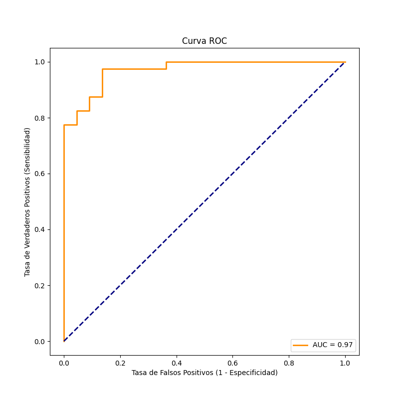
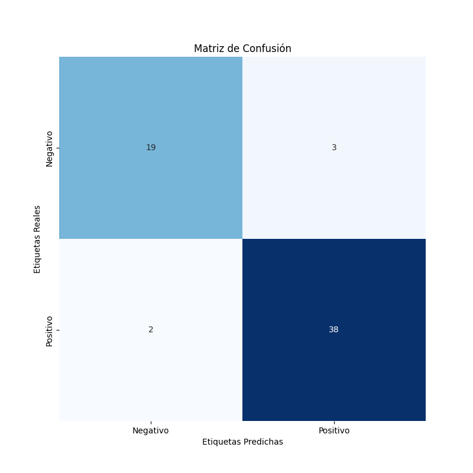

# HPylori-detector
Aquest projecte aborda la detecció de la bacterià Helicobacter pylori, aquesta bacterià és la causa principal de gastritis i pot conduir a altres malalties greus, com úlcera gàstrica i fins i tot càncer. La principal forma de poder fer la seva detecció és a través de l'anàlisi d'imatges histològiques amb tinció immunohistoquímica, un procés en el qual determinats anticossos tenyits s'uneixen a antígens de l'element
biològic d'interès. Aquesta anàlisi és una tasca que requereix molt temps pels professionals de la salut, és per això que farem ús d'una xarxa neuronal on aplicarem l'ús d'un ''AutoEncoder'' per a la detecció de patrons de tinció anòmals sencers tenyits inmunohistoquímicamente en imatges histològiques i fer la seva posterior classificació, respecte si compte la bacterià o pel contrari està sa.

## Codi
L'estructura del projecte es la següent:
1. ``main.py``: Conté el codi principal del projecte, a l'executar-lo es posa en funcionament tot el sistema per entrenar/testejar el model d'autoencoder.
2. ``config.json``: Conte la configuració utilitzada durant el projecte.
3. ``handlers``:
   - ``__init__.py``: Imports llibreries.
   - ``cofiguration.py``: Carrega configuració per els paràmatres del model i permet multi-execució.
   - ``data.py``: Crida per recuperar les dades del dataset a través de la classe Dataset i crear els DataLoaders.
   - ``generator.py``: Genera objecte model i les seves funcions derivades per guardar-lo i carregar-lo.
   - ``train.py``: Entrenament del model.
   - ``test.py``: Test i mètriques model.
4. ``objects``:
   - ``__init__.py``: Imports llibreries.
   - ``dataset.py``: Defineix classes dataset per carregar i guardar les dades.
   - ``model.py``: Defineix l'arquitectura del model.
5. ``models``: Contenidor per guardar els models generats en format .pickle.
6. ``plots``: Contenidor per guardar les figures referents a les mètriques del model.

# Dataset

La base de dades QuirionDataBase amb la que s’ha treballat conte les carpetes ``CroppedPatches`` i ``AnnotedPatches`` amb els seus csv corresponents ``metadata.csv`` i ``window_metadata.csv``. 

La carpeta ``CroppedPatches`` conte una carpeta per cada pacient amb la identificació B22-X on X és la id del pacient, la carpeta per cada pacient conte les seves imatges histològiques retallades. El csv corresponent a CroppedPatches conte la densitat de bacterià que trobem en cada pacient (*BAIXA, ALTA,NEGATIVA*) representat amb la seva id. Per altra banda, tenim la carpeta ''AnnotedPtaches'' la qual és un subconjunt de CroppedPatches, la diferència en aquest cas és que conté un csv amb la següent *informació id_pacient, numero_patch, positiu/negatiu* d'aquesta forma tenim un ground truth d'imatges etiquetades.

# Metedologia

La metodologia a seguir per classificar les imatges histològiques dels pacients i poder determinar la densitat de la bacterià que tenen consistirà a fer l'ús d'un autoencoder per la reconstrucció d'imatges. L'objectiu darrere d'aquest autoencoder és overfitejar la reconstrucció d'imatges amb pacients amb densitat de bacterià negativa, la qual cosa es tradueix en el fet que les seves imatges histològiques no contenen Helicobacter. La presència d'Helicobacter en imatges es veu representada amb punts en el canal vermell de la imatge. A l'overfitejar imatges de pacient que no contenen punts en aquest canal vermell la reconstrucció tampoc en tindrà, de forma que en reconstruir imatges que si que continguin el bacteri la seva reconstrucció serà errònia, ja que tampoc contindrà els punts en el canal vermell de sortida. Es pot veure la reconstrucció d'imatges en la *Figura 1*

#### Figura 1

| Negative Reconstruction | Positive Reconstruction|
| -------------| ------------- | 
|||
*Reconstrucció imatges autoencoder*

Es podrà saber quines són les imatges infectades mirant la freqüència dels seus punts en el canal vermell, és a dir, ``Fred = input (punts en el canal vermell) / outuput / (punts en el canal vermell)``. Si ``Fred > 1`` significarà que tenim menys punts vermells en el canal de sortida que en el d'entrada, per tant, la reconstrucció estarà mal feta i sabrem que aquella imatge conte Helicobacter.

Finalment, només caldrà classificar el pacient segons la densitat de bacterià Helicobacter que contingui.

Es pot veure el procés mostrar en la *Figura 2*

#### Figura 2

*Pau Cano,Alvaro Caravaca,Debora Gil,and Eva Musulen.Schema of the main steps in the detection of H. pylori.
 https://arxiv.org/pdf/2309.16053.pdf*

## Dataloader 

Per tant, pel desenvolupament del projecte s'ha definit una classe pare ''QuirionDataset'' amb dues classes filles ``CroppedDataset`` i ``AnnotedDataset`` les quals agafaran els datasets mencionats. I es dividiran de forma que la classe ``CroppedDataset`` només s'utilitzarà per a l'entrenament del model i utilitzant només aquelles imatges de pacient amb una densitat d'Helicobacter *negativa* i que no estiguin contingudes en el subconjunt ``d'AnnotedDataset``. Del total d'aquestes imatges negatives un 80% s'utilitzaran per entrenament i el 20% restant per validació.

Per altra banda la classe ``AnnotedDataset`` agafarà totes les seves imatges tant negatives com positives i s'utilitzaran per fer la seva classificació amb el model prèviament entrenat.

## Arquitectura model

L'arquitectura d'autoencoder que s'utilitza per l'entrenament del model és la següent.

S'ha definit un codificador que pren una imatge d'entrada de 32x32 píxels i 3 canals (RGB). Aquesta imatge passa per dues capes *convolucionals* de 64 i 32 filtres i dues capes de *(max pooling)* per reduir la seva dimensió de 64x46 -> 32x32 -> 8x8 .I entremig capes d'activació Relu, això permet capturar les característiques més importants de la imatge. Per tant, finalment acabem en una representació de 8x8.

Respecte a la definició del descodificador, pren aquesta representació de 8x8 i l'amplia utilitzant dues capes de convolució transposada de 32 i 64 filtres per aconseguir una imatge reconstruïda de 32x32 píxels. I entremig una capa d'activació Relu. Finalment, una funció d'activació sigmoide s'aplica per assegurar que els valors de sortida estiguin entre 0 i 1.

### Entrenament model

Per fer l'entrenament del model s'utilitza un total de 10000 imatges.

Per l'entrenament del model s'han emprat els següents paràmetres , ``30 epoques`` amb la funció d'optimització ``Adam`` i un leraning rate de ``0.0001``. Donat que el model ha tret uns bons resultats i l'arquitectura l'autoencoder no és massa complex en aquest treball no s'ha aprofundit en trobar un possible model millor.

## Classificació d'Imatges

Com ja s'ha comentat en anteriors punts, la classificació d'imatges es farà utilitzant el dataset ``d'AnnotedPactces``, ja que podrem comparar els seus resultats ja que tenim aquests etiquetats.

### Determinació threshold 

Un cop s'ha fet la reconstrucció de la imatge abans de determinar si és positiva o no, es passarà la seva representació en RGB normalitzada entre 0 i 1 a l'espai de color HSV, tal com es pot veure en la *Figura 3*. El HSV és un espai de color on en el canal vermell es podrà determinar en quin punt es vol que comenci a decidir que és vermell i en quin s'acabi.

#### Figura 3

*Espai de color HSV.[https://arxiv.org/pdf/2309.16053.pdf](https://es.wikipedia.org/wiki/Modelo_de_color_HSV)*

Per tant, es farà el recompte de píxels en canal vermell de la imatge en HSV de la imatge original *input* i de la posterior a la reconstrucció ``output``. Per determinar la seva freqüència ``Fred`` es dividirà el resultat del recompte ``Input/Output`` i es podrà dibuixar un ROC curve *Figura 4* donat que tenim el *ground truth* de la classificació de les imatges. Això es fa per determinar quin és el millor *threshold* per fer la classificació.

Per determinar aquest millor threshold es fa us del *Youden's J statistic* on es busca el valor ``youden_index = tpr - fpr`` (on tpr és *True positive rate* i fpr és *false positive rate*) on es buscarà el threshold que maximitzi el *Youden's J statistic* ``optimal_threshold = thresholds[np.argmax(youden_index)]``.

El millor threshold ha estat determinat en 3.0, per tant, ``Fred > 3`` imatge positiva en Helicobacter.

#### Figura 4

### Mètriques i resultats

 __Confusing Matrix__ 

Observant la matriu de confusió, es veu com aconseguim un ``Accuracy 94%``, també observem que tenim més FN que FP cosa que no ens interessa tant, ja que és més probable que es faci una segona revisió per un professional si surt positiu que si surt negatiu.

## Classificació Pacient

Una vegada les imatges dels pacients es troben classificades com a positives o negatives, es pot definir si el pacient ha donat positiu o negatiu a partir de les dades de ''CroppedPatches''. D'igual forma per trobar el threshold òptim de la classificació de les imatges del pacient, es fa una divisió entre el nombre d'imatges positives reals amb les predites y trobar el threshold més òptim amb la ROC curve.

### Mètriques i resultats

Aquests són els resultats de predicció de 62 pacients (~100.000 imatges):

Només 5 pacients han estat classificats erròniament, podrien ser *outlayers* de les propies dades, però s'hauria d'acabar de confirmar.

## Contributors
* Sergi Tordera - 1608676@uab.cat
* Eric Alcaraz - 1603504@uab.cat                
* Raul Dalgamoni - 1599225@uab.cat

